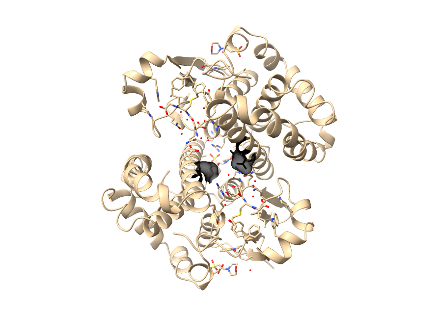

# Pocket Binding Prediction

A machine learning pipeline for predicting protein-ligand binding sites from PDB structures, inspired by the P2Rank approach. The pipeline extracts geometric, physicochemical and evolutionary features from protein surfaces, trains a Random Forest classifier, and produces residue lists and visualization files for each predicted pocket.

Done by: _Montserrat Palazón, Marta Sotelo and Maria Pau Pijoan_

---

## Project structure

```
pocket_binding_prediction/
├── data/
│   ├── *.pdb                    # input protein structures
│   ├── fastas/                  # generated FASTA sequences
│   ├── pssms/                   # generated conservation scores
│   ├── pdb_parser.py            # PDB loading and data model
│   └── prepro.py                # PDB → FASTA conversion
├── geometry/
│   ├── neighbors.py             # KDTree-based neighbor search
│   ├── sas.py                   # SAS point generation
│   └── features.py              # feature extraction (39 features)
├── model/
│   └── labels.py                # SAS point labelling (binding / non-binding)
├── output/
│   └── pocket_writer.py         # residue CSV + visualization PDB writer
├── visualization/
│   ├── __init__.py              # empty — marks folder as Python module
│   └── visualize.py             # ChimeraX auto-visualization script
├── evolution.py                 # mock PSSM generator
├── consolidate_results.py.      # lists of amino acids involved in each detected site
├── predict.py                   # quick prediction script (score CSV only)
└── main.py                      # full pipeline entry point (train + predict)
```

---

## Installation

```bash
pip install biopython freesasa scipy numpy scikit-learn joblib
```

### ChimeraX (required for automated visualization)

Download and install ChimeraX from: https://www.cgl.ucsf.edu/chimerax/download.html

> **Important:** the path to the ChimeraX executable is different on each system and must be set manually in `visualization/visualize.py` (see the Visualization section below). Without this, the pipeline will still run correctly and produce all output files — only the automated screenshot step will be skipped.

---

## Usage

### Step 1 — Convert PDB → FASTA

```bash
python prepro.py
```

Reads all `.pdb` files in `data/` and saves a `.fasta` file per protein in `data/fastas/`.

### Step 2 — Generate PSSM conservation scores

```bash
python evolution.py
```

Reads the FASTA files and produces mock conservation score CSV files in `data/pssms/`. These are random scores used as placeholders, replace with real PSI-BLAST output when available (see Evolution section below).
However, due to consuming computational resources , the pssm won't be used in a the command line input. 
### Step 3 — Train the model

```bash
python main.py train data/chen11/ --model_out my_model.pkl
python main.py train data/chen11/ --pssm_dir data/pssms/ --model_out my_model.pkl
```

Processes all PDB files in the training folder, extracts features and labels, trains a Random Forest, and saves the model as `my_model.pkl`.

> **Note:** training on large datasets (e.g. chen11) takes approximately 1 hour without taking into account the `--pssm_dir data/pssms/ ` as mentioned previously, because this would need higher computational resources (HPC). 

### Step 4 — Predict on new proteins

```bash
# Single file
python main.py predict data/1GUA.pdb --model my_model.pkl --threshold 0.4 --output_dir output/ --results_dir results/

# Whole directory (e.g. 100 proteins)
python main.py predict data/subset_holo4k/ --model my_model.pkl --threshold 0.4 --output_dir output/ --results_dir results/
```

### Step 5 — Visualize results

```bash
# Open the combined PDB manually in PyMOL
pymol output/pockets/121p_pockets.pdb

# Or open the combined PDB in ChimeraX
alias chimerax='open -a /Applications/ChimeraX-1.11.1.app'
chimerax output/pockets/121p_pockets.pdb

# Or run the pre-generated ChimeraX script for a specific protein
chimerax results/cmd_scripts/visualize_121p.cxc
```

---

## CLI flags

| Flag | Mode | Default | Purpose |
|---|---|---|---|
| `--pssm_dir` | both | `None` | Folder with `.pssm` conservation files |
| `--model_out` | train | `my_model.pkl` | Where to save the trained model |
| `--model` | predict | `my_model.pkl` | Which model to load |
| `--threshold` | predict | `0.3` | Min probability to count a point as binding |
| `--output_dir` | predict | `output/` | Where to write CSV and PDB output files |
| `--results_dir` | predict | `results/` | Where to write ChimeraX format outputs |

Built-in help:
```bash
python main.py --help
python main.py train --help
python main.py predict --help
```

---

## `predict.py` — quick prediction (score summary only)

A lightweight alternative to `main.py` that outputs only a pocket-level score CSV without writing visualization files. Useful for quick scoring during development.

```bash
python predict.py data/1GUA.pdb
python predict.py data/subset_holo4k/
```

Output: `csv/<protein_name>_results.csv` with pocket center coordinates and scores.

---

## Pipeline

The pipeline runs the following sequential steps for each PDB file:

```
[1] Load protein         pdb_parser.py     → Protein object (atoms, residues, ligands)
[2] Build KDTree         neighbors.py      → Efficient spatial search index
[3] Generate SAS points  sas.py            → Surface point cloud
[4] Extract features     features.py       → Feature matrix (N_points × 39)
[5] Label points         labels.py         → Binary labels (binding / non-binding)
[6] Train / load model   main.py           → RandomForest classifier
[7] Cluster pockets      main.py           → DBSCAN on high-probability SAS points
[8] Write outputs        pocket_writer.py  → Residue CSV + visualization PDB
[9] Auto-visualize       visualize.py      → ChimeraX .cxc script + screenshot
```

---

## Output files

### After running `main.py predict` on a protein (e.g. `121p`)

```
output/
├── csv/
│   └── 121p_residues.csv         ← amino acids involved in each pocket
└── pockets/
    └── 121p_pockets.pdb          ← combined PDB for PyMOL / ChimeraX

results/
├── pdbs/
│   ├── 121pcluster_1.pdb         ← atoms of predicted pocket 1
│   ├── 121pcluster_2.pdb         ← atoms of predicted pocket 2
│   └── ...
├── logs/
│   ├── 121p_results.log          ← pocket scores for this protein
│   └── all_results.log           ← consolidated log for all proteins
├── cmd_scripts/
│   └── visualize_121p.cxc        ← ChimeraX script (open manually or auto-run)
└── screenshots/
    └── 121p_clusters.png         ← auto-rendered image (if ChimeraX available)
```

### File contents

**`output/csv/121p_residues.csv`** — the scientific result:
```
pocket_id, chain, residue_id, residue_name, center_x, center_y, center_z
1,         A,     13,         GLY,          12.431,   8.201,    5.112
1,         A,     14,         LYS,          14.821,   9.043,    5.891
2,         A,     42,         ASP,          22.111,   14.302,   9.442
```

**`results/logs/all_results.log`** — consolidated scores for all proteins:
```
========================================
Protein: 121p
========================================
Cluster 1: score=0.4690
Cluster 2: score=0.4520

========================================
Protein: 121as
========================================
Cluster 1: score=0.8200
...
```

**`output/pockets/121p_pockets.pdb`** — contains the full protein as `ATOM` records and each predicted pocket as `HETATM` records on a separate chain (B, C, D…), allowing independent colouring in PyMOL or ChimeraX.

---

## Visualization

### Automated (ChimeraX)

The pipeline automatically generates a `.cxc` script per protein in `results/cmd_scripts/` and attempts to run ChimeraX headlessly to produce a screenshot. 

> **Important — user configuration required:** the path to the ChimeraX executable is system-dependent and must be set manually in `visualization/visualize.py`. Find the line:
> ```python
> subprocess.run(["/Applications/ChimeraX.app/Contents/bin/ChimeraX", ...])
> ```
> and replace the path with the correct one for your system:
>
> | OS | Typical path |
> |---|---|
> | macOS | `/Applications/ChimeraX.app/Contents/bin/ChimeraX` |
> | Linux | `/usr/bin/chimerax` or `/opt/chimerax/bin/chimerax` |
> | Windows | `C:\Program Files\ChimeraX\bin\ChimeraX.exe` |

> **Note on screenshots:** ChimeraX in `--nogui` mode requires OpenGL rendering support. If your system does not support headless OpenGL (common on Mac), the screenshot step will be skipped automatically and the pipeline will continue. All `.cxc` scripts are saved regardless and can be opened manually at any time.

### Manual visualization in ChimeraX

```bash
# Open a pre-generated script (protein already coloured by pocket)
chimerax results/cmd_scripts/visualize_121p.cxc

# Or open the combined PDB and colour manually
chimerax output/pockets/121p_pockets.pdb
```

Inside ChimeraX:
```
color /A grey          # protein grey
color /B red           # pocket 1 red
color /C blue          # pocket 2 blue
show /B surface
show /C surface
```


So, the `visualize_clusters` function in `visualize.py` does use the cluster PDB files from `results/pdbs/` to generate the ChimeraX command script (`.cmd` file). 

The `visualize.py` script acts as the automation bridge between the model's numerical predictions and professional visual validation. While `main.py` generates the raw coordinate data for predicted pockets, this script is responsible for automatically "bringing them to life" within ChimeraX.

The script generates a structured results directory to streamline the analysis:

1. __Visualization Commands__ (`results/cmd_scripts/visualize_[PDB_ID].cxc`):

This is a ChimeraX command file (macro). Instead of manually searching for and coloring residues, this script automates the entire process:

- Opens the original protein structure.

- Colors the predicted pocket residues (e.g., using specific RGB scales).

- Generates surfaces with 50% transparency to allow a clear view of the pocket interior.

Each of the files containes the word `exit` and this produces closure of the `cxc` files when opened from the command line like:

```
alias chimerax='open -a /Applications/ChimeraX-1.11.1.app'

chimerax results/cmd_scripts/visualize_121p.cxc
```

To solve this, run this command `find "/Users/mariapaupijoan/Desktop/Master/2nd TERM/SBI-PYT/pocket_binding_prediction/results/cmd_scripts" -type f \( -name "*.cxc" -o -name "*.cmd" \) -exec sed -i '' '/^[[:space:]]*exit[[:space:]]*$/d' {} +`. Double check that only the `exit` word is removed properly from all the `cxc` files, and run again `chimerax results/cmd_scripts/visualize_121p.cxc`.

__IMPORTANT__: Once have opened the `visualize_X.cxc` file, open its respective protein pocket from _pocket_binding_prediction/output/pockets_ and you'll better where the binding sites are!!

2. __Result Logs__ (`results/logs/[PDB_ID]_results.log`):
An organized summary of the model's findings. The script parses this file to identify pockets with the highest scores for prioritized visualization.

3. __PDB Clusters__ (`results/pdbs/`):
Small PDB files containing only the atoms belonging to each predicted cluster. These serve as spatial references so the visualization script knows exactly which parts of the protein to highlight.

To have a single file with the lists of amino acids involved in each detected site, run this command `python consolidate_results.py --pdbs_dir results/pdbs/ --output results/all_binding_residues.csv` and this will produce a csv file in `results/` called `all_binding_residues.csv`. 


4. __Automated Screenshots__ (`results/screenshots/`):
If ChimeraX is installed in the standard path, the script can run in headless mode to execute commands and save `.png` images automatically. This is ideal for high-throughput processing of multiple proteins.

### Manual visualization in PyMOL

```bash
pymol output/pockets/121p_pockets.pdb
```

Inside PyMOL:
```python
color grey, chain A
color red,  chain B
color blue, chain C
show spheres, chain B
show spheres, chain C
show cartoon, chain A
```


---

## Modules

### `data/pdb_parser.py`

Parses a `.pdb` file into three Python objects:

- `Atom` — stores 3D coordinates, element, name and residue info
- `Residue` — groups atoms and computes the geometric center
- `Protein` — top-level container that separates protein atoms from ligand atoms (water molecules are excluded)

```python
protein = Protein("data/1GUA.pdb")
protein.load()

protein.atoms         # list of Atom objects
protein.residues      # list of Residue objects
protein.ligand_atoms  # list of Atom objects (ligands only)
```

### `data/prepro.py`

Converts a PDB file to FASTA format using `Bio.PPBuilder`, which physically traces connected amino acids in the structure. Handles multi-chain proteins.

### `geometry/neighbors.py`

A thin wrapper around `scipy.spatial.KDTree`. Built once from all atom coordinates and used throughout the pipeline for efficient radius searches.

```python
neighbor_search = NeighborSearch(coords)
indices = neighbor_search.query(point, radius=10.0)
```

### `geometry/sas.py`

Generates the Solvent Accessible Surface (SAS) point cloud:

1. Uses `freesasa` (Shrake-Rupley algorithm) to identify exposed atoms (SASA > threshold)
2. Places random points around each surface atom at a fixed distance
3. Filters out any point that falls inside the protein (closer than 1.2 Å to any atom)

```python
generator  = SASPointGenerator(protein, neighbor_search)
sas_points = generator.generate_SAS()   # numpy array (N, 3)
```

### `geometry/features.py`

Extracts a 39-dimensional feature vector for each SAS point. Features are computed from the local atomic environment within a 10 Å radius.

| Group | Features | Count |
|---|---|---|
| Geometry | Neighbor count, mean/std/min distance, local density, depth, normalized depth | 7 |
| Physicochemical | Hydrophobicity (mean/std), charge (total/pos/neg), H-bond donors/acceptors, amino acid composition (fractions) | 27 |
| Advanced geometry | Surface curvature (PCA), pocket depth (ray casting), hydrophobic patch score, charge dipole magnitude | 4 |
| Evolutionary | PSSM conservation score of nearest residue | 1 |
| **Total** | | **39** |

**Feature descriptions:**

- `neighbor_count` — number of protein atoms within 10 Å; pockets have higher counts than flat surfaces
- `mean_distance / std_distance` — low std indicates a tight enclosed pocket
- `density` — atoms per ų; deep pockets are denser
- `depth / depth_norm` — distance to protein centroid normalized by protein radius
- `mean_hydrophobicity` — Kyte-Doolittle scale average over neighboring residues
- `total_charge / n_positive / n_negative` — net charge and charge counts of unique neighboring residues at pH 7
- `n_hbond_donors / n_hbond_acceptors` — atom-level counts of hydrogen bond participants
- `aa_fractions` — fraction of each of the 20 canonical amino acids among neighboring residues
- `curvature` — PCA eigenvalue ratio; high value = concave/curved (pocket-like)
- `pocket_depth` — fraction of outward rays blocked by protein atoms (0 = exposed, 1 = fully enclosed)
- `hydrophobic_patch_score` — inverse mean pairwise distance of hydrophobic atoms; high = clustered patch
- `charge_dipole` — magnitude of the spatial charge separation vector
- `conservation_score` — PSSM score of the nearest residue (0 = variable, 1 = conserved)

### `model/labels.py`

Assigns a binary label to each SAS point based on its distance to the nearest ligand atom. A point receives label `1` (binding) if it is within the threshold distance of any ligand atom in `protein.ligand_atoms`, and `0` otherwise. Labels are only available during training, when the PDB file contains an experimentally determined ligand.

### `output/pocket_writer.py`

Converts predicted pocket centers into output files. Contains four methods:

- `get_pocket_residues()` — finds all residues within 5 Å of a pocket center
- `write_residues_csv()` — saves the residue list as a CSV with coordinates
- `write_visualization_pdb()` — writes a combined PDB with protein + pockets on separate chains
- `write_chimera_format()` — writes one PDB per cluster + `results.log` + consolidated `all_results.log`

### `visualization/visualize.py`

Generates a `.cxc` ChimeraX command script for each protein and optionally runs ChimeraX headlessly to produce a screenshot. Each pocket is coloured a different colour using HSV colour cycling. The script uses ChimeraX-native syntax:

- `preset "publication 2"` — depth-cued publication style
- `surface /A:13 transparency 50` — transparent surface per residue
- `color /A:13 r,g,b` — colour by pocket
- `view` — fit the structure in the window
- `exit` — close ChimeraX after finishing

> The subprocess call must be updated with the correct ChimeraX path for your system — see the Visualization section above.

### `evolution.py`

Generates a mock PSSM CSV with random conservation scores per residue. This is a placeholder for real PSI-BLAST output. The output format is:

```
Residue_Index,Residue,Conservation_Score
1,M,0.8543
2,K,0.2341
```

To replace with real PSSM data, run PSI-BLAST against UniRef90 and parse the output into the same CSV format — no other changes to the pipeline are needed.

---

## Feature lookup tables

All lookup tables are defined at module level in `features.py`:

- `HYDROPHOBICITY` — Kyte-Doolittle scale for all 20 amino acids
- `CHARGE` — formal charge at pH 7 (ARG/LYS +1, HIS +0.1, ASP/GLU -1)
- `HBOND_DONORS` — atom names that donate hydrogen bonds
- `HBOND_ACCEPTORS` — atom names that accept hydrogen bonds
- `AMINO_ACIDS / AA_INDEX` — ordered list and index map for one-hot encoding
- `HYDROPHOBIC_RESIDUES` — set of 9 hydrophobic residue names used for patch scoring

---

## Results

The following image shows the training results on the chen11 dataset, which took approximately one hour to complete.


This protein-ligand binding site prediction model shows high reliability but follows a conservative prediction strategy. With a precision of 0.96, the model is extremely accurate when it identifies a binding site, meaning nearly all predicted pockets are likely to be biologically relevant. However, the lower recall of 0.46 indicates that it currently captures less than half of the total true binding surface, likely due to the significant class imbalance where binding points represent only 4.5% of the 2.8 million training samples. This conservative behavior results in a respectable F1-score of 0.62, suggesting that while the model misses some peripheral binding areas, it effectively identifies the core hotspots of the pockets.

In addition, the final pipeline fulfills the objective of the assignment: it takes a protein structure in `.pdb` format as input and predicts ligand-binding sites using a structure-based approach. For each analyzed protein, the program generates (i) a CSV file listing the amino acids involved in each detected pocket, for example `output/csv/121p_residues.csv`, and (ii) a visualization-ready PDB file such as `output/pockets/121p_pockets.pdb`, which can be opened in ChimeraX or PyMOL. The auxiliary files in `results/` (`pdbs/`, `logs/`, `cmd_scripts/`, and `screenshots/`) further support interpretation and presentation of the predicted binding sites.

Therefore, the project delivers the requested outputs: protein-structure input, predicted ligand-binding sites, residue lists for each site, and files suitable for molecular visualization software.



This is an example of the binding site prediction pockets is represented using ChimeraX.

---

## References

- Xia Y., Pan X., Shen H-B. (2024). *A comprehensive survey on protein-ligand binding site prediction*. Current Opinion in Structural Biology, 86, 102793.
- Krivák R., Hoksza D. (2018). *P2Rank: machine learning based tool for rapid and accurate prediction of ligand binding sites from protein structure*. J Cheminformatics, 10, 1–12.
- Jumper J. et al. (2021). *Highly accurate protein structure prediction with AlphaFold*. Nature, 596, 583–589.
